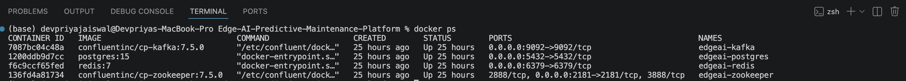
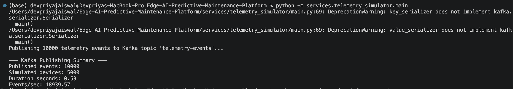
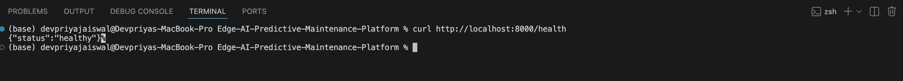
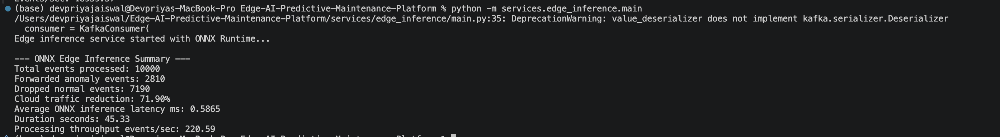
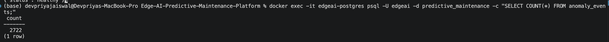
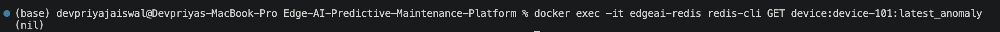
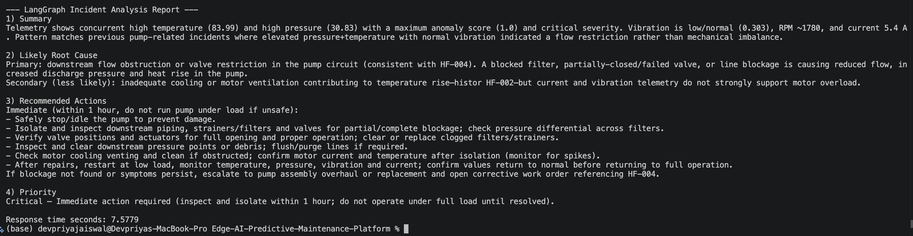

# Edge AI Predictive Maintenance Platform

<p align="center">

**Real-Time Industrial Predictive Maintenance using Edge AI, ONNX Runtime, Apache Kafka, FastAPI, PostgreSQL, Redis, LangGraph, ChromaDB, and Azure OpenAI**

</p>

<p align="center">


</p>

---

# Overview

Imagine a manufacturing plant with **thousands of industrial machines** continuously generating sensor readings such as:

* Temperature
* Pressure
* Vibration
* Voltage
* Current
* RPM
* Humidity

Traditional monitoring systems forward **every sensor reading** to the cloud—even when over 95% of the data represents normal operating conditions.

This creates several challenges:

* High cloud bandwidth consumption
* Increased storage costs
* Higher inference latency
* Slower incident response
* Unnecessary processing of normal telemetry

---

## How this project solves the problem

This project demonstrates an **Edge AI architecture** for industrial predictive maintenance.

Instead of sending every telemetry event to the cloud:

1. Industrial devices continuously generate telemetry.
2. Telemetry is streamed through Apache Kafka.
3. An **ONNX Runtime model** performs anomaly detection directly at the edge.
4. Normal events are discarded locally.
5. Only anomalous events are transmitted to the cloud.
6. The cloud enriches anomalies with historical maintenance knowledge using **vector search (ChromaDB)**.
7. A **LangGraph-powered AI workflow** combines telemetry, historical failures, and maintenance runbooks.
8. **Azure OpenAI GPT-5-mini** generates an explainable incident report containing:

   * Root cause analysis
   * Similar historical failures
   * Recommended maintenance actions
   * Incident priority

The result is a scalable, bandwidth-efficient predictive maintenance platform capable of producing explainable AI-assisted maintenance recommendations.

---

# Key Highlights

* Simulates **5,000 industrial IoT devices**
* Streams telemetry through **Apache Kafka**
* Performs **edge-side anomaly detection** using ONNX Runtime
* Reduces cloud-bound telemetry by forwarding only anomalous events
* Stores anomaly history in PostgreSQL
* Caches latest device state using Redis
* Uses ChromaDB for semantic retrieval of historical failures
* Implements Retrieval-Augmented Generation (RAG)
* Orchestrates AI reasoning with LangGraph
* Generates explainable maintenance reports using Azure OpenAI GPT-5-mini

---

# Table of Contents

* Overview
* System Architecture
* End-to-End Workflow
* Key Features
* Technology Stack
* Repository Structure
* Installation
* Running the Project
* API Documentation
* LangGraph Workflow
* Retrieval-Augmented Generation (RAG)
* Performance Benchmarks
* Project Walkthrough
* Screenshots
* Future Improvements
* License

---

# System Architecture

```text
                    +-----------------------------------+
                    | Telemetry Simulator               |
                    | 5,000 Industrial IoT Devices      |
                    +----------------+------------------+
                                     |
                                     |
                                     ▼
                         +-------------------------+
                         | Apache Kafka            |
                         | telemetry-events Topic  |
                         +-----------+-------------+
                                     |
                                     ▼
                +------------------------------------------+
                | Edge Inference Service                   |
                | ONNX Runtime + Isolation Forest          |
                +-------------------+----------------------+
                                    |
                     Normal         |          Anomaly
                    Discard         |          Forward
                                    ▼
                      +-----------------------------+
                      | FastAPI Cloud Service       |
                      +-------------+---------------+
                                    |
                +-------------------+--------------------+
                |                                        |
                ▼                                        ▼
         PostgreSQL                              Redis Cache
     Historical Events                    Latest Device State
                |
                ▼
      +-------------------------+
      | ChromaDB Vector Search  |
      +-----------+-------------+
                  |
                  ▼
          Historical Failures
          Maintenance Runbooks
                  |
                  ▼
        +------------------------+
        | LangGraph AI Workflow  |
        +-----------+------------+
                    |
                    ▼
      Azure OpenAI GPT-5-mini
                    |
                    ▼
      Explainable Incident Report
```

---

# End-to-End Workflow

```text
Telemetry Generated
        │
        ▼
Apache Kafka
        │
        ▼
Edge AI (ONNX Runtime)
        │
 ┌──────┴─────────┐
 │                │
 ▼                ▼
Normal        Anomaly
Discard        Forward
                   │
                   ▼
          FastAPI Cloud API
                   │
      ┌────────────┴────────────┐
      ▼                         ▼
 PostgreSQL                 Redis Cache
      │
      ▼
Semantic Retrieval (ChromaDB)
      │
      ▼
LangGraph Agent
      │
      ▼
Azure OpenAI GPT-5-mini
      │
      ▼
Maintenance Report
```

---

# Features

## Edge AI

* Real-time anomaly detection using ONNX Runtime
* Lightweight edge inference
* Local filtering of normal telemetry
* Reduced cloud communication

---

## Streaming

* Apache Kafka event pipeline
* High-throughput telemetry ingestion
* Producer/consumer architecture

---

## Cloud Backend

* FastAPI REST API
* PostgreSQL persistence
* Redis caching
* Modular microservice design

---

## Agentic AI

* LangGraph workflow orchestration
* Retrieval-Augmented Generation (RAG)
* ChromaDB semantic search
* Azure OpenAI integration
* Explainable maintenance recommendations

---

## Observability

* Dockerized infrastructure
* Project validation screenshots
* Benchmark outputs
* Proof artifacts included

---

# Technology Stack

| Layer           | Technology              |
| --------------- | ----------------------- |
| Language        | Python                  |
| API             | FastAPI                 |
| Messaging       | Apache Kafka            |
| Edge ML         | Isolation Forest        |
| Edge Inference  | ONNX Runtime            |
| Database        | PostgreSQL              |
| Cache           | Redis                   |
| AI Workflow     | LangGraph               |
| Vector Database | ChromaDB                |
| Embeddings      | Sentence Transformers   |
| LLM             | Azure OpenAI GPT-5-mini |
| Containers      | Docker Compose          |
| Data Validation | Pydantic                |
| Environment     | Python Dotenv           |

---

# Why Edge AI?

Instead of transmitting every sensor reading to the cloud, this architecture performs anomaly detection directly on the edge device.

### Benefits

* Lower bandwidth usage
* Faster anomaly detection
* Lower cloud inference costs
* Reduced cloud storage
* Better scalability
* Lower operational latency
* Explainable AI-assisted maintenance decisions

---

# Repository Structure

```text
Edge-AI-Predictive-Maintenance-Platform/

├── services/
│   ├── telemetry_simulator/
│   │   └── main.py
│   │
│   ├── edge_inference/
│   │   └── main.py
│   │
│   ├── cloud_api/
│   │   └── main.py
│   │
│   └── incident_agent/
│       ├── llm_client.py
│       ├── knowledge_base.py
│       ├── langgraph_agent.py
│       └── main.py
│
├── training/
│   └── train_anomaly_model.py
│
├── models/
│   └── isolation_forest.onnx
│
├── database/
│
├── data/
│   ├── historical_failures.json
│   └── knowledge_base/
│
├── docs/
│   └── metrics/
│
├── screenshots/
│
├── docker-compose.yml
├── requirements.txt
├── .env.example
└── README.md
```

---

# Service Responsibilities

| Service             | Responsibility                                                     |
| ------------------- | ------------------------------------------------------------------ |
| Telemetry Simulator | Simulates thousands of industrial IoT devices generating telemetry |
| Kafka               | Streams telemetry events between services                          |
| Edge Inference      | Runs ONNX Runtime model locally to detect anomalies                |
| Cloud API           | Receives anomalies and stores them in PostgreSQL & Redis           |
| Incident Agent      | Performs semantic retrieval and AI-powered incident analysis       |

---

# Quick Start

## 1. Clone Repository

```bash
git clone https://github.com/YOUR_USERNAME/Edge-AI-Predictive-Maintenance-Platform.git

cd Edge-AI-Predictive-Maintenance-Platform
```

---

## 2. Create Python Environment

```bash
python -m venv .venv
```

Activate:

### macOS / Linux

```bash
source .venv/bin/activate
```

### Windows

```powershell
.venv\Scripts\activate
```

---

## 3. Install Dependencies

```bash
pip install -r requirements.txt
```

---

# Environment Variables

Create:

```text
.env
```

using:

```text
.env.example
```

Example:

```env
AZURE_OPENAI_API_KEY=YOUR_KEY

AZURE_OPENAI_ENDPOINT=https://YOUR_RESOURCE.services.ai.azure.com

AZURE_OPENAI_DEPLOYMENT=gpt-5-mini

AZURE_OPENAI_API_VERSION=2024-10-21
```

---

# Start Infrastructure

Launch Kafka, PostgreSQL, Redis, and supporting services.

```bash
docker compose up -d
```

Verify:

```bash
docker ps
```

---

# Create Kafka Topic

```bash
docker exec -it edgeai-kafka kafka-topics \
--create \
--topic telemetry-events \
--bootstrap-server localhost:9092 \
--partitions 3 \
--replication-factor 1
```

Verify:

```bash
docker exec -it edgeai-kafka kafka-topics \
--list \
--bootstrap-server localhost:9092
```

Expected:

```
telemetry-events
```

---

# Train the Edge AI Model

Generate the ONNX model:

```bash
python training/train_anomaly_model.py
```

Output:

```
models/isolation_forest.onnx
```

---

# Start Cloud API

```bash
cd services/cloud_api

uvicorn main:app --reload --port 8000
```

Health Check:

```bash
curl http://localhost:8000/health
```

Expected:

```json
{
  "status":"healthy"
}
```

---

# Generate Telemetry

Open another terminal:

```bash
python -m services.telemetry_simulator.main
```

This simulates approximately **5,000 industrial IoT devices** producing telemetry.

Example:

```
Generated events: 10000

Simulated devices: 5000

Events/sec: 39,000+
```

---

# Run Edge AI

```bash
python -m services.edge_inference.main
```

The service:

* Consumes Kafka events
* Loads the ONNX model
* Detects anomalies
* Drops normal telemetry
* Sends only anomalous events to the Cloud API

---

# Run AI Incident Analysis

```bash
python -m services.incident_agent.main
```

The pipeline automatically:

1. Reads latest anomaly
2. Retrieves similar historical failures
3. Retrieves maintenance runbooks
4. Performs semantic retrieval
5. Calls Azure OpenAI
6. Generates explainable maintenance report

---

# REST API

## Health Check

```
GET /health
```

Response

```json
{
  "status":"healthy"
}
```

---

## Store Anomaly

```
POST /anomalies
```

Stores anomaly information in:

* PostgreSQL
* Redis

---

# LangGraph Workflow

The AI workflow consists of multiple reasoning stages.

```text
Latest Anomaly
      │
      ▼
Retrieve Historical Failures
      │
      ▼
Retrieve Maintenance Runbooks
      │
      ▼
Semantic Search (ChromaDB)
      │
      ▼
Prompt Construction
      │
      ▼
Azure OpenAI GPT-5-mini
      │
      ▼
Incident Report
```

Unlike a single LLM prompt, LangGraph allows each reasoning step to be modular, reusable, and independently testable.

---

# Retrieval-Augmented Generation (RAG)

Rather than relying only on the language model's knowledge, the system first retrieves relevant maintenance knowledge.

Sources include:

* Historical equipment failures
* Maintenance runbooks
* Similar anomaly patterns

The retrieved context is injected into the prompt before sending it to Azure OpenAI, enabling grounded and explainable responses.

---

# PostgreSQL Storage

Each anomaly stores:

* Device ID
* Timestamp
* Temperature
* Pressure
* Vibration
* Voltage
* Current
* RPM
* Humidity
* Anomaly Score
* Severity

This historical dataset enables future analytics and trend analysis.

---

# Redis Cache

Redis stores the **latest anomaly** for each device, enabling low-latency retrieval without repeatedly querying PostgreSQL.

Example Redis key:

```
device:device-101:latest_anomaly
```
---

# Performance Benchmarks

The platform was tested using a simulated industrial environment consisting of **5,000 virtual IoT devices** continuously generating telemetry.

| Metric                       | Result                           |
| ---------------------------- | -------------------------------- |
| Simulated Devices            | 5,000                            |
| Telemetry Events Generated   | 10,000+                          |
| Edge ML Model                | Isolation Forest (ONNX Runtime)  |
| Cloud Database               | PostgreSQL                       |
| Cache                        | Redis                            |
| AI Orchestration             | LangGraph                        |
| LLM                          | Azure OpenAI GPT-5-mini          |
| Vector Search                | ChromaDB                         |
| Typical AI Report Generation | ~7–9 seconds (network dependent) |

---

# System Validation

The following artifacts are included in this repository to demonstrate that each component of the platform was successfully implemented and validated.

## Infrastructure

* Docker containers running
* Kafka topic creation
* PostgreSQL storage
* Redis caching

## Edge AI

* ONNX model generation
* Edge inference execution
* Telemetry filtering

## Cloud Backend

* FastAPI health endpoint
* REST API validation
* PostgreSQL persistence

## AI Workflow

* Vector retrieval
* LangGraph orchestration
* Azure OpenAI incident analysis

---

# Project Walkthrough

The following screenshots demonstrate the complete execution flow of the platform.

---

## 1. Docker Infrastructure

All supporting services are started using Docker Compose.


---

## 2. Kafka Streaming

Telemetry events are published to Kafka before being consumed by the edge inference service.



---

## 3. FastAPI Cloud Service

Health endpoint confirms that the cloud backend is operational.



---

## 4. Edge AI Inference

The ONNX Runtime model evaluates telemetry locally and forwards only anomalous events.



---

## 5. PostgreSQL Persistence

Detected anomalies are stored for historical analysis.



---

## 6. Redis Cache

The latest anomaly for each device is cached for low-latency access.



---

## 7. AI Incident Analysis

LangGraph retrieves historical failures and maintenance knowledge before Azure OpenAI generates an explainable incident report.



---

# Example AI Incident Report

The AI-generated report includes:

* Executive summary
* Root cause analysis
* Supporting historical evidence
* Recommended maintenance actions
* Incident priority

Example output:

```text
Summary
--------
Critical anomaly detected for industrial pump.

Likely Root Cause
-----------------
Downstream blockage causing elevated pressure and temperature.

Recommended Actions
-------------------
• Inspect downstream valves
• Check strainers and filters
• Verify cooling system
• Reduce operating load
• Schedule maintenance inspection

Priority
--------
Critical
```

---

# Engineering Highlights

This project demonstrates experience with several production-oriented software engineering concepts.

### Distributed Systems

* Event-driven architecture
* Asynchronous message processing
* Service decoupling with Kafka

---

### Backend Engineering

* REST API development
* PostgreSQL persistence
* Redis caching
* Dockerized services

---

### Machine Learning

* Isolation Forest anomaly detection
* ONNX Runtime inference
* Edge deployment strategy

---

### Generative AI

* Azure OpenAI integration
* LangGraph orchestration
* Retrieval-Augmented Generation (RAG)
* Semantic search using ChromaDB

---

### Software Architecture

* Modular microservices
* Separation of concerns
* Configurable infrastructure
* Production-style project organization

---

# Possible Future Enhancements

Future work could include:

* Kubernetes deployment
* Multi-region Kafka clusters
* Prometheus metrics
* Grafana dashboards
* Real-time WebSocket monitoring
* Authentication and RBAC
* Multi-model edge inference
* Streaming analytics dashboard
* Model retraining pipeline
* Automated CI/CD pipeline
* Distributed tracing and observability

---

# References

* FastAPI
* Apache Kafka
* PostgreSQL
* Redis
* Docker
* ONNX Runtime
* LangGraph
* ChromaDB
* Azure OpenAI
* Sentence Transformers

---

# Contributing

Contributions, suggestions, and improvements are welcome.

If you find a bug or have an idea for enhancing the platform, feel free to open an issue or submit a pull request.

---

# License

This project is licensed under the MIT License.

---

# ⭐ If you found this project interesting...

If this repository helped you learn something about Edge AI, distributed systems, or AI-powered predictive maintenance, consider giving it a ⭐.

It helps others discover the project and supports continued development.

---

<p align="center">

**Built with ❤️ using Python, FastAPI, Apache Kafka, PostgreSQL, Redis, ONNX Runtime, LangGraph, ChromaDB, and Azure OpenAI.**

</p>
